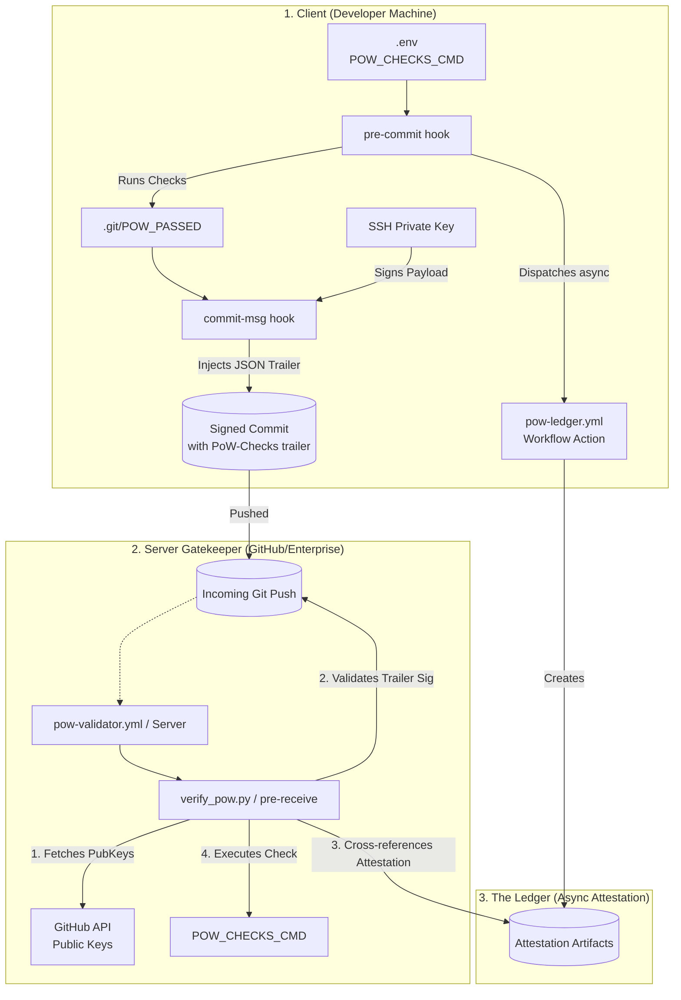

# PoW-Hook Architecture

PoW-Hook is a highly secure, cryptographic Proof-of-Work system for Git. It strictly enforces that developers run required quality checks (linters, secret scanners, unit tests) locally before they are permitted to push to a central repository.

The system is constructed with an aggressive trust-no-one zero-trust architecture, treating the developer's client machine as untrusted until proven otherwise by cryptographic signatures and remote server-side attestations.

## High-Level Component Overview



## How It Works (Sequence)

The system enforces compliance through a carefully choreographed 4-phase sequence.

```mermaid
sequenceDiagram
    actor Dev as Developer
    participant Git as Local Git hooks
    participant Ledger as GitHub Action<br/>(pow-ledger.yml)
    participant GH as GitHub API
    participant Validator as Gatekeeper<br/>(verify_pow.py)

    Note over Dev, Git: Phase 1: Local Pre-commit
    Dev->>Git: git commit
    Git->>Git: Execute `pre-commit` hook
    Git->>Git: Hash `POW_CHECKS_CMD` (SHA256)
    Git->>Git: Generate unique Session UUID
    Git->>Git: Run defined quality checks
    
    %% Attestation Dispatch
    Note over Git, Ledger: Phase 2: Remote Attestation
    Git->>Ledger: workflow_dispatch (Session ID, Status, Cmd Hash)
    Git->>Git: Write execution metadata to `.git/POW_PASSED`
    Ledger-->>GH: Upload Ledger Artifact<br/>`pow-attestation-{session}-{cmd_hash}-PASSED`
    
    Note over Dev, Git: Phase 3: Cryptographic Signing
    Git->>Git: Execute `commit-msg` hook
    Git->>Git: Retrieve Tree Hash natively
    Git->>Git: Read metadata from `.git/POW_PASSED`
    Git->>Git: Construct Payload `checks_hash|tree_hash|session_id|status`
    Git->>Git: Digitally Sign payload with Local SSH Private Key
    Git->>Git: Base64 Encode JSON bundle
    Git->>Git: Inject `PoW-Checks: <Base64>` metadata trailer
    Git-->>Dev: Commit finalized locally

    Note over Dev, Validator: Phase 4: Push Gatekeeper Zero-Trust Verification
    Dev->>GH: git push origin main
    GH->>Validator: Push Event triggers Validator
    
    Validator->>GH: Query developer's Public SSH Keys (`/users/user/keys`)
    GH-->>Validator: Return Public Keys
    
    Validator->>Validator: Extract Base64 `PoW-Checks` payload
    Validator->>Validator: Cryptographically verify SSH signature
    
    Validator->>Validator: Hash Server's strictly expected `POW_CHECKS_CMD`
    Validator->>Validator: Assert local hash securely matches server hash
    
    Validator->>GH: Query GitHub Actions API for Artifact matching Session ID & Hash
    GH-->>Validator: Return artifact match
    
    Validator->>Validator: Independently execute POW_CHECKS_CMD on server codebase
    
    alt If Signature, Hash, Artifacts match, AND Check passes
        Validator-->>GH: Accept Commit natively
    else Any deviation
        Validator-->>GH: Block Push / Revert Forcefully natively
        Validator->>GH: Query open Pull Requests bound to branch
        Validator->>GH: Close compromised Pull Request automatically
        Validator->>GH: Post Tagged Comment with Support Ticket URL
        GH-->>Dev: Alert administrators of unverified commit breach
    end
```



## Anatomy of a Signed Commit

Once the Proof-of-Work process is complete, the commit carries a `PoW-Checks` trailer containing the cryptographic attestation.

### Example Commit Log
```text
commit ce9ae77c517308f59eae02c895135249d6dac062 (HEAD -> main, origin/main, origin/HEAD)
Author: Dimitrios Dimitriou <dimitriou.d.a@gmail.com>
Date:   Sun May 3 20:41:00 2026 +0300

    Test6

    PoW-Checks: eyJ0b2tlbiI6ICJHQTAzMk56QkhDYmRuV3R3RktIOHZIRGNjWkZSSmNscXRsY2FvdWVyWkI3Z3Fyd1R5bnR4ZXNvOXIhcXB6N2VKSEZFNmpKWjNza0h2Um80Ri9HR3ZBQT09Iiwic2Vzc2lvbiI6ICJiM2YyNGZkOS05ZjAxLTQwZTUtYjc4OS02NjI3OWMwNGI2NWIiLCJzdGF0dXMiOiAiUEFTU0VEIiwiY2hlY2tzX2hhc2giOiAiNzA0ZTZjNWQwNThiMzdkZWJmM2Yzk1NzVjYmUyZDNhNWQwYzk0MDE4MWM2ODQyOGQ4MjJjYmU5YjYzYTkxMyJ9
```

### Decoded PoW-Checks Trailer
The `PoW-Checks` value is a Base64-encoded JSON bundle containing the signature and session metadata:

```json
{
  "token": "GA032NzBHCbdnWtwFKH8vHDccZFRJclqtlcaouerZB7gqrwTynxeso9I+qpz7eJHFE6jJZ3skHvRo4F/GGvAA==",
  "session": "b3f24fd9-9f01-40e5-b789-66279c04b65b",
  "status": "PASSED",
  "checks_hash": "704e6c5d058b37debf3f39575cbe2d3a5d0c940181c68428d822cbe9b63a913"
}
```

- **token**: The cryptographic signature of the payload (`checks_hash|tree_hash|session|status`) generated using the developer's local SSH private key.
- **session**: A unique UUID generated for this validation session, used to cross-reference the server-side attestation artifact.
- **status**: The local result of the quality checks (must be `PASSED`).
- **checks_hash**: A SHA-256 hash of the `POW_CHECKS_CMD` that was executed. The server re-calculates this hash to ensure the developer didn't run a different (weaker) command locally.

## Security Guarantees & Tamper Resistance

1. **Commit Tree integrity**: The commit signature encompasses `.git/tree_hash`. If a developer manipulates files post-validation, the tree hash mutates, violating and destroying the signature validity.
2. **Key Non-Repudiation**: Developers do not upload random public keys manually. The server inherently trusts the keys registered dynamically on `github.com/settings/ssh`, meaning only the legitimate user profile can forge their own signatures. 
3. **Execution Masking Hacks**: Command execution commands (`POW_CHECKS_CMD`) are cryptographically packaged and verified. A developer cannot run `docker run my-fake-tests` locally because the server gatekeeper will hash its own expected command string and detect the divergence.
4. **Air-Gap Prevention**: The async Ledger step guarantees that developers cannot "mock" a signature locally without checking in with the server. Even if a local signature evaluates flawlessly, if the GitHub Action Ledger never generated the secondary artifact, the push is aggressively rejected.
5. **Zero-Trust Server Execution Fallback**: Even if an attacker maliciously forges a signature and manually spoofs the Ledger attestation via the GitHub API, the server gatekeeper independently executes the exact same quality checks on the incoming repository state. Any securely injected vulnerabilities are caught via this zero-trust mechanism.
