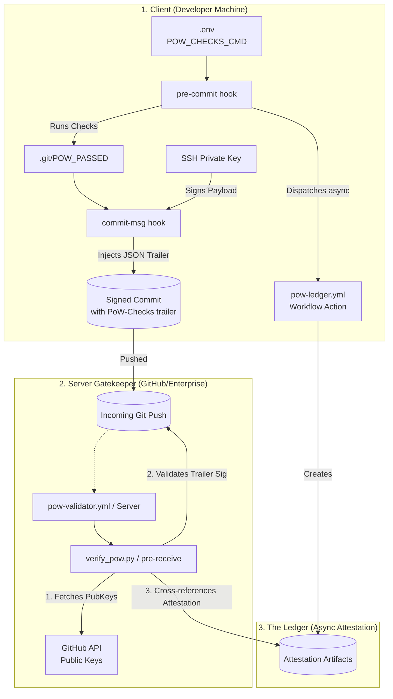
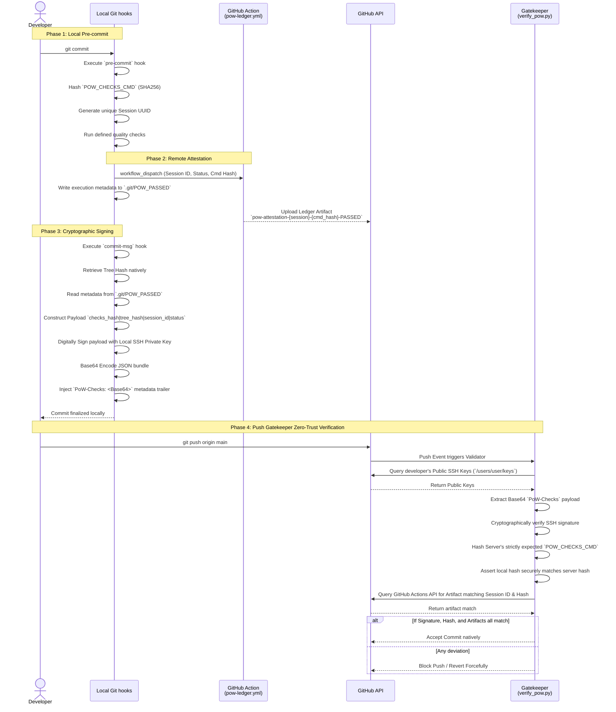

# PoW-Hook Architecture

PoW-Hook is a highly secure, cryptographic Proof-of-Work system for Git. It strictly enforces that developers run required quality checks (linters, secret scanners, unit tests) locally before they are permitted to push to a central repository.

The system is constructed with an aggressive trust-no-one zero-trust architecture, treating the developer's client machine as untrusted until proven otherwise by cryptographic signatures and remote server-side attestations.

## High-Level Component Overview

## How It Works (Sequence)

The system enforces compliance through a carefully choreographed 4-phase sequence.

## Security Guarantees & Tamper Resistance

1. **Commit Tree integrity**: The commit signature encompasses `.git/tree_hash`. If a developer manipulates files post-validation, the tree hash mutates, violating and destroying the signature validity.
2. **Key Non-Repudiation**: Developers do not upload random public keys manually. The server inherently trusts the keys registered dynamically on `github.com/settings/ssh`, meaning only the legitimate user profile can forge their own signatures. 
3. **Execution Masking Hacks**: Command execution commands (`POW_CHECKS_CMD`) are cryptographically packaged and verified. A developer cannot run `docker run my-fake-tests` locally because the server gatekeeper will hash its own expected command string and detect the divergence.
4. **Air-Gap Prevention**: The async Ledger step guarantees that developers cannot "mock" a signature locally without checking in with the server. Even if a local signature evaluates flawlessly, if the GitHub Action Ledger never generated the secondary artifact, the push is aggressively rejected.
